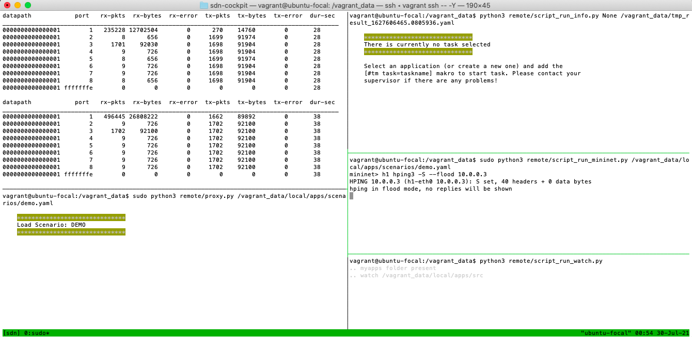

# Functional Testing

## Test 1.1 : Network Connectivity
**Tool used : Hping3**  
**Command entered : pingall**  
- Test designed to check network connectivity between the eight hosts on the 
network.
- As the image below shows the eight hosts are connected without any 
restrictions

Image 1.1 : Establishing hosts are able to send and receive data on the network
  

## Test 1.2 : Handle Arp Packets
**Tool used : Hping3**  
**Command 1 : pingall**  
**Command 2 : dpctl dump-flows**  
- Check that the handle_arp function in project.py is working. 
- This will forward ARP packets to directly connected network nodes. 
- As the image below shows the flow rule created for this is matching on arp packets and functioning as intended.

Image 1.2 : Displaying the handle_arp flow rule
  

## Test 1.3 : Switching Hub
**Tool used : Hping3**  
**Command 1 : pingall**  
**Command 2 : dpctl dump-flows**  
- Testing that the switching hub is functioning correctly. 
- The switching hub learns the mac address of the host, information about the
connected port and creates a flow rule. 
- This means that once a host has been learned packets can be transferred without flooding.
- The image below shows that the switching hub is functioning as intended.

Image 1.3 : Displaying flow rules created by the switching hub
  

## Test 1.4 : Traffic Monitor
**Tool used : Hping3**  
**Command entered : h1 hping3 -S -c 10 10.0.0.2**  

- As the image below shows the traffic monitor is functioning normally. 
- It provides information on packets sent and received, duration in seconds etc. 
- The information printed out on the controller pane in the top left.
- After sending 10 SYN packets from host one it can be seen in the top left pane that port one and two have sent 
and received just over ten more packets than other ports showing the monitor is gathering data accurately.

Image 1.4 : Traffic monitor displaying port stats
  

## Test 1.5 : High Traffic Volume Detection
**Tool used : Hping3**  
**Command entered : h1 hping3 -S --flood 10.0.0.2**  

- The application will continually store the number of packets transmitted. 
- The ryu controller is printing this information below the traffic monitor which is displayed in the top left pane of sdn-cockpit e.g OrderedDict([(56, 9), (61, 9) etc.
- The order and time delay between storing is inconsistent though as image 1.5.1 below shows.
 

Image 1.5.1 : Ordered dictionary collecting packets transmitted and duration 
port has been alive  
   
  
- After initiating a flood attack the application successfully matches on TCP traffic and
redirects it towards the controller. 
- This will add latency but allows for detection and mitigation of a SYN flood attack. 
- Image 1.5.2 below shows traffic being processed by the controller.

Image 1.5.2 : Controller processing packets transmitted 
before the drop rule was created  
   
  
- Image 1.5.3 below shows us the duration the port has been collecting statistics which is 49 seconds in this case.
- In image 1.5.1 above the attack hasn't been initiated so it's clear based on these images that at some point
in that 20 second window a high volume of traffic was detected and traffic was redirected to the controller.

Image 1.5.3 : Duration the application has 
been running  
   
  
- This suggests the traffic monitor can detect and react reasonably fast towards high volumes of traffic.
- It should be noted however, that after this test was completed additional code was added which includes a condition
stating that if a high volume of traffic is detected within the first 60 seconds of the application then
traffic will be directed towards the controller.
- This has since been updated to within the first 300 seconds of the application.

## Test 1.6 : Ip Address And Packet Storage
**Tool used : Hping3**  
**Command entered : h1 hping3 -S -c 10 10.0.0.2**  

- In order to assess the traffic on the network, (after TCP traffic is redirected towards the controller)
the ip address of users is recorded along with the number of SYN and ACK packets each ip address has sent.
- Image 1.6 below shows this information being stored accurately for ip address 10.0.0.1 which has
sent 10 packets towards ip address 10.0.0.2

Image 1.6 : Dictionary storing ip addresses, number of SYN packets sent and number of ACK packets sent
  

## Test 1.7 : SYN ACK Ratio Drop Rule
**Tool used : Hping3**  
**Command entered : h1 hping3 -S 10.0.0.2 -a 20.0.0.1 -c 5**

- If a host sends two SYN packets but doesn't send any ACK packets then the application determines they are an attacker using a 
spoofed ip address and employs a block rule. 
- As image 1.7 below shows, three SYN packets were sent but a drop rule successfully drops the 
remaining two packets that were sent by ip address 20.0.0.1

Image 1.7 : Drop rule blocking user with spoofed ip address
  

## Test 1.8 : SYN ACK Ratio Drop Rule Timeout
**Tool used : Hping3**  
**Command entered : h1 hping3 -S 10.0.0.2 -a 20.0.0.1 -c 5**

- After ten seconds have passed if the user has not tried to send any additional packets then
the drop rule will timeout. 
- This is intended to account for the possibility of a user being blocked because of a delay
in their sending an ACK packet.

Image 1.8 : Drop rule from image 1.7 is no longer present due to idle timeout
  

## Test 1.9 : Trusted Users List
**Tool used : Hping3**  
**Command 1 : h1 hping3 -S -c 10 10.0.0.2**
**Command 2 : h1 hping3 -S -c 1 10.0.0.2**

- After a user has sent more than ten SYN and ACK packets they will be added to a trusted user list.
- In image 1.9.1 below we see that after ten packets have been sent by host 1 there are no users in this list.
There is only an empty array being printed just below the ip addresses.

Image 1.9.1 : Empty trusted users list
   
  
- As image 1.9.2 below shows, after 11 SYN and ACK packets have been sent host 1 with
an ip address of 10.0.0.1 has now been added to teh trusted user list. 
- This is intended to make the process of evaluating ip addresses on the network faster.

Image 1.9.2 : Trusted user list with one ip address added
  

## Test 1.10 : High Volume Per Ip Address Drop Rule
**Tool used : Hping3**  
**Command entered : h1 hping3 -S 10.0.0.2 --flood**

- While TCP traffic is being directed to the controller, if a single user sends over 1000 SYN packets
a drop rule is created for that ip address. 
- This is to account for the possibility that a malicious user might not spoof their ip address. 
- As image 1.10 below shows a drop rule has been added and 21365 packets have been dropped.

Image 1.10 : Drop rule for high volume of traffic per ip address
  

## Test 1.11 : Ip Address And Packet List Clear
**Tool used : Hping3**  
**Command entered : h1 hping3 -S --flood 10.0.0.2 --rand-source**

- If the list containing ip addresses and SYN ACK packets sent grows too large then the application will clear it.
- This is intended to make the process of searching through the list faster for the application. 
- As image 1.11.1 below shows there are 8 recorded ip addresses. This number is printed just below the list of ip addresses.

Image 1.11.1 : Dictionary of ip addresses containing 
total length of 8
  
  
- After initiating a SYN flood with random ip addresses we can see in image 1.11.2 below
that 169640 packets were sent from different ip addresses. 
- However, the number of stored ip addresses is printed as 1755. This demonstrates that the 
list is in fact being cleared after it reaches a size of 10000.
  

Image 1.11.2 Dictionary of ip addresses 
containing total length of 1755
   

## Test 1.12 : TCP Traffic To Controller Timeout Rule
**Tool used : Hping3**  
**Command entered : h1 hping3 -S 10.0.0.2 --flood**

- After initiating a SYN flood attack we can see from image 1.12.1 below that a rule has been added directing tcp traffic to the controller.

Image 1.12.1 : Flow rule directing all 
TCP traffic to controller
   
  
- After the idle timeout has passed and traffic is no longer spiking on the network we can see in image 1.12.2 below that traffic is 
no longer being directed to the controller.

Image 1.12.2 : Flow rule of image 1.12.1 no longer 
present due to idle timeout
   
  
- After sending SYN packets from host 1 as shown in image 1.12.3 below it is clear that this TCP traffic
is no longer being directed to the controller.

Image 1.12.3 : TCP traffic no longer being directed to the 
controller
  

****

# Non Functional Testing

## Bandwidth Testing

## Test 2 : Checking the bandwidth between two hosts while the application is running
**Tool used : Hping3, Xterm, iPerf**  
**Command 1 (entered on h2) : iperf -s**  
**Command 2 (entered on h1) : iperf -c 10.0.0.2**  
**Command 2 was repeated five times to gain a better approximation of the available bandwidth while the application is running**  

- As bandwidth isn't be used to evaluate the solution testing was very light and is used only to 
establish and show what the bandwidth is while the application is running

Image 2.1 : The results after checking the bandwidth twice

|Test No.|h1 Interval |h2 Interval |Transfer |h1 Bandwidth | h2 Bandwidth |
|--------|------------|------------|---------|-------------|--------------|
|2.1     |0.0-10.4s   |0.0-13.6s   |6.38 mb  |5.15mbits/s  |3.93mbits/s   |
|2.2     |0.0-11.9s   |0.0-14.3s   |671 mb   |475mbits/s   |394mbits/s    |

Image 2.2 : The final result of assessing the bandwidth

|Test No.|h1 Interval |h2 Interval |Transfer |h1 Bandwidth | h2 Bandwidth |
|--------|------------|------------|---------|-------------|--------------|
|2.3     |0.0-10.5s   |0.0-14.5s   |767 mb   |613mbits/s   |444mbits/s    |
|2.4     |0.0-11.3s   |0.0-16.1s   |6.62mb   |4.93mbits/s  |3.45mbits/s   |
|2.5     |0.0-10.2s   |0.0-11.5s   |5.75mb   |4.71mbits/s  |4.18mbits/s   |

## Latency Testing

## Test 3.1 : Sending ten SYN packets to one host without sending packets through the controller
**Tools used : Hping3**  
**Command entered : h1 hping3 -S 10.0.0.3 -c 10**

|Test No.|Scenario             |R.T.T   |Average |Max     |
|--------|---------------------|--------|--------|--------|
|3.1     |Not Controller       |0.8ms   |6.0ms   |18.3ms  |

Image 3.1 : Latency test when SYN packets are not sent through the controller
  

## Test 3.2 : Sending ten SYN packets to one host while sending packets through the controller
**Tools used : Hping3**  
**Command entered : h1 hping3 -S 10.0.0.3 -c 10**

|Test No.|Scenario             |R.T.T   |Average |Max     |
|--------|---------------------|--------|--------|--------|
|3.2     |Controller           |10.4ms  |16.8ms  |23.2ms  | 

Image 3.2 : Latency test when SYN packets are sent through the controller
  

## Test 3.3 : Sending ten SYN packets to one host while one attacker is launching a flood attack
**Tools used : Hping3, Xterm**  
**Command 1 : hping3 -S 10.0.0.3 -a 20.0.0.1 --flood**  
**Command 2 : hping3 -S 10.0.0.3 -c 10**  

|Test No.|Scenario             |R.T.T   |Average |Max     |
|--------|---------------------|--------|--------|--------|
|3.3     |Blocking 1 attacker  |16.1ms  |19.7ms  |24.4ms  |

Image 3.3 : Latency test while blocking one attacker
  

## Test 3.4 : Sending ten SYN packets to one host while two attackers are launching a flood attack
**Tools used : Hping3, Xterm**  
**Command 1 : hping3 -S 10.0.0.3 -a 20.0.0.1 --flood**  
**Command 2 : hping3 -S 10.0.0.3 -a 20.0.0.2 --flood**  
**Command 3 : hping3 -S 10.0.0.3 -c 10**  

|Test No.|Scenario             |R.T.T   |Average |Max     |
|--------|---------------------|--------|--------|--------|
|3.4     |Blocking 2 attackers |3.4ms   |9.4ms   |16.0ms  |

Image 3.4 : Latency test while blocking two attackers
  

## Test 3.5 : Two hosts attacking one host (100 packets per second)
**Tools used : Hping3, Xterm**  
**Command 1 : hping3 -S 10.0.0.3 -a 20.0.0.1 --flood**  
**Command 2 : hping3 -S 10.0.0.3 -a 20.0.0.2 --flood**  
**Command 3 : hping3 -S 10.0.0.3 -a 20.0.0.3 --flood**  
**Command 4 : hping3 -S 10.0.0.3 -a 20.0.0.4 --flood**  
**Command 5 : hping3 -S 10.0.0.3 -a 20.0.0.5 --flood**  
**Command 6 : hping3 -S 10.0.0.3 -c 10**  

|Test No.|Scenario             |R.T.T   |Average |Max     |
|--------|---------------------|--------|--------|--------|
|3.5     |Blocking 5 attackers |7.2ms   |10.5ms  |19.4ms  |

Image 3.5 : Latency test while blocking five attackers
  

## Packet Drop Rate

## Test 4.1 : One host attacking one host (100 packets per second)
**Tool used : Hping3**  
**Command entered : h1 hping3 -S 10.0.0.3 -a 20.0.0.1 --faster**  

- Test 4.1 involved one host sending packets to ip address 10.0.0.3 (host 3)
- 124,045 packets were transmitted
- 124,010 packets were dropped by flow rule
- 35 packets were sent by the attacker before they were stopped

Image 4.1 : Drop rule for ip address 20.0.0.1
  

## Test 4.2 : Two hosts attacking one host (100 packets per second)
**Tools used : Hping3, Xterm**  
**Command 1 : hping3 -S 10.0.0.3 -a 20.0.0.1 --faster**  
**Command 2 : hping3 -S 10.0.0.3 -a 20.0.0.2 --faster**

- Test 4.2 involved two hosts sending packets to ip address 10.0.0.3 (host 3)
- 278,397 packets transmitted by h1 and 262,931 were transmitted by h2 (total : 541,328)
- 278,381 packets were dropped out of those sent by h1 and 262,930 were dropped out
of those sent by h2 (total : 541,311)
- 16 packets were sent by h1 and 1 packet was sent by h2 before they were stopped

Image 4.2 : Packets transmitted by h1 and h2 and drop rule for these hosts
  

## Test 4.3 : Five hosts attacking one host (100 packets per second)
**Tools used : Hping3, Xterm**  
**Command 1 : hping3 -S 10.0.0.3 -a 20.0.0.1 --faster**  
**Command 2 : hping3 -S 10.0.0.3 -a 20.0.0.2 --faster**  
**Command 3 : hping3 -S 10.0.0.3 -a 20.0.0.3 --faster**  
**Command 4 : hping3 -S 10.0.0.3 -a 20.0.0.4 --faster**  
**Command 5 : hping3 -S 10.0.0.3 -a 20.0.0.5 --faster**  

- Test 4.3 involved five hosts sending packets to ip address 10.0.0.3
- Image 4.3.1 below shows sdn-cockpit after the attack. It takes roughly 240 seconds for the controller
to stop processing the large number of packets thus allowing other hosts to send data again

Image 4.3.1 : Duration the application has been 
running
   

- h4 transmitted 481,105 packets
- h5 transmitted 478,761 packets
- h6 transmitted 501,885 packets
- h7 transmitted 520,165 packets
- h8 transmitted 535,112 packets
- Total 2,517,028 packets transmitted

Image 4.3.2 : Packets transmitted by h4 - h8
   

- 481,075 packets dropped for h4. 30 packets were not blocked
- 461,754 packets dropped for h5. 17,007 packets were not blocked
- 499,338 packets dropped for h6. 2,547 packets were not blocked
- 505,705 packets dropped for h7. 14,460 packets were not blocked
- 527,152 packets dropped for h8. 7,960 packets were not blocked
- 2,475,024 packets dropped in total. 42,004 packets in total were not blocked

Image 4.3.3 : Drop rule showing packets dropped for h4 - h8
  

## Test 4.4 : Seven hosts attacking one host (100 packets per second)
**Tools used : Hping3, Xterm**  
**Command 1 : hping3 -S 10.0.0.3 -a 20.0.0.1 --faster**  
**Command 2 : hping3 -S 10.0.0.3 -a 20.0.0.2 --faster**  
**Command 3 : hping3 -S 10.0.0.3 -a 20.0.0.4 --faster**  
**Command 4 : hping3 -S 10.0.0.3 -a 20.0.0.5 --faster**  
**Command 5 : hping3 -S 10.0.0.3 -a 20.0.0.6 --faster**  
**Command 6 : hping3 -S 10.0.0.3 -a 20.0.0.7 --faster**  
**Command 7 : hping3 -S 10.0.0.3 -a 20.0.0.8 --faster**  

- Test 4.4 involved seven hosts sending packets to ip address 10.0.0.3
- Image 4.4.1 below shows sdn-cockpit after the attack has been stopped. After 588 seconds the application had failed to create
drop rules for two out of seven attackers
- This test possibly demonstrates a major limitation of the application
- Generating too many flow rules can overwhelm the switch
- Further testing will be required to assess whether this has occurred with seven hosts

Image 4.4.1 : Duration the application has been 
running
   
  
- h1 transmitted 304,245 packets
- h2 transmitted 299,002 packets
- h4 transmitted 303,768 packets
- h5 transmitted 311,397 packets
- h6 transmitted 289,204 packets
- h7 transmitted 309,057 packets
- h8 transmitted 289,781 packets
- Total 2,106,454 packets transmitted

Image 4.4.2 : Packets transmitted by h1, h2 and 
h4 - h8
   
  
- 304,239 packets dropped for h1. 6 packets were not dropped
- 292,483 packets dropped for h2. 6,519 packets were not dropped
- 299,023 packets dropped for h4. 4,745 packets were not dropped
- 303,705 packets dropped for h5. 7,692 packets were not dropped
- 0 packets dropped for h6. 289,204 packets were not dropped
- 242,219 packets dropped for h7. 66,838 packets were not dropped
- 0 packets dropped for h8. 289,781 packets were not dropped
- 2,475,024 packets dropped in total. 664,785 packets in total were not dropped

Image 4.4.3 : Drop rule and packets dropped for h1, h2 
and h4 - h8
  

## Test 4.5 : One host attacking one host (flood mode - as fast as possible)
**Tools used : Hping3**  
**Command entered : hping3 -S 10.0.0.3 -a 20.0.0.1 --flood**

- Test 4.5 involved one host sending packets to ip address 10.0.0.3 as fast as possible
- After 38 seconds a drop rule has been created and the controller is no longer processing traffic 
allowing hosts to send packets again

Image 4.5.1 : Duration the application has been 
running
   
  
- 1,854,870 packets were transmitted
- 1,854,492  packets were dropped by flow rule
- 378 packets were sent by the attacker before the rule took effect

Image 4.5.2 : Packets transmitted and dropped by an added flow rule
  

## Test 4.6 : Two hosts attacking one host (flood mode - as fast as possible)
**Tools used : Hping3, Xterm**  
**Command 1 : hping3 -S 10.0.0.3 -a 20.0.0.1 --flood**  
**Command 2 : hping3 -S 10.0.0.3 -a 20.0.0.2 --flood**

- Test 4.6 involved two hosts sending packets to ip address 10.0.0.3 as fast as possible
- After 84 seconds a drop rule has been created and the controller is no longer processing 
traffic allowing hosts to send packets again

Image 4.6.1 : Duration that the application has been 
running
   
  
- 1,637,558 packets were transmitted by h1 and 2,144,807 were transmitted by h2 (total : 3,782,365)

Image 4.6.2 : Packets transmitted by h1 and h2
   
  
- 1,637,537 packets were dropped out of those sent by h1 and 1,659,167 were dropped out
of those sent by h2 (total : 3,296,704)
- 21 packets were sent by h1 and 485,640 packet was sent by h2 before they were stopped (total : 485,661)

Image 4.6.3 : Packets dropped for h1 and h2
  

## Test 4.7 : Five hosts attacking one host (flood mode - as fast as possible)
**Tools used : Hping3, Xterm**  
**Command 1 : hping3 -S 10.0.0.3 -a 20.0.0.1 --flood**  
**Command 2 : hping3 -S 10.0.0.3 -a 20.0.0.2 --flood**  
**Command 3 : hping3 -S 10.0.0.3 -a 20.0.0.3 --flood**  
**Command 4 : hping3 -S 10.0.0.3 -a 20.0.0.4 --flood**  
**Command 5 : hping3 -S 10.0.0.3 -a 20.0.0.5 --flood**  

- Test 4.7 involved five hosts sending packets to ip address 10.0.0.3 as fast as possible
- After 403 seconds a drop rule has been created and the controller is no longer processing 
traffic allowing hosts to send packets again

Image 4.7.1 : Duration that the application has been 
running
   
  
- 3,809,827 packets were transmitted by h4
- 4,314,601 packets were transmitted by h5
- 4,982,715 packets were transmitted by h6
- 5,792,773 packets were transmitted by h7
- 6,534,523 packets were transmitted by h8

Image 4.7.2 : Number of packets transmitted by 
h4 - h8
   
  
- 3,808,512 were dropped for h4. 1,315 packets were not dropped
- 3,837,243 were dropped for h5. 477,358 packets were not dropped
- 4,524,972 were dropped for h6. 457,743 packets were not dropped
- 5,288,735 were dropped for h7. 504,038 packets were not dropped
- 6,068,071 were dropped for h8. 466,452 packets were not dropped
- Total of 23,527,533 dropped. 1,906,906 packets were not dropped

Image 4.7.3 : Number of packets dropped for h4 - h8
  

## Test 4.8 : Six hosts attacking one host (flood mode - as fast as possible)
**Tools used : Hping3, Xterm**  
**Command 1 : hping3 -S 10.0.0.3 -a 20.0.0.1 --flood**  
**Command 2 : hping3 -S 10.0.0.3 -a 20.0.0.2 --flood**  
**Command 3 : hping3 -S 10.0.0.3 -a 20.0.0.3 --flood**  
**Command 4 : hping3 -S 10.0.0.3 -a 20.0.0.4 --flood**  
**Command 5 : hping3 -S 10.0.0.3 -a 20.0.0.5 --flood**  
**Command 6 : hping3 -S 10.0.0.3 -a 20.0.0.6 --flood**  

- Test 4.8 involved six hosts sending packets to ip address 10.0.0.3 as fast as possible
- After 675 seconds a drop rule has been created and the controller is no longer processing 
traffic allowing hosts to send packets again

Image 4.8.1 : Duration that the application has been 
running
   
  
- 4,179,273 packets were transmitted by h1
- 4,506,537 packets were transmitted by h4
- 5,437,825 packets were transmitted by h5
- 6,016,493 packets were transmitted by h6
- 6,705,047 packets were transmitted by h7
- 7,182,357 packets were transmitted by h8

Image 4.8.2 : Number of packets transmitted by 
h1 and h4 - h8
   
  
- 3,714,076 were dropped for h1. 465,197 packets were not dropped
- 3,640,452 were dropped for h4. 866,085 packets were not dropped
- 4,370,373 were dropped for h5. 1,067,452 packets were not dropped
- 4,923,963 were dropped for h6. 1,092,530 packets were not dropped
- 5,454,596 were dropped for h7. 1,250,451 packets were not dropped
- 5,876,824 were dropped for h8. 1,305,533 packets were not dropped
- Total of 27,980,284 dropped. 6,047,248 packets were not dropped

Image 4.8.3 : Number of packets dropped for h1 and 
h4 - h8
  

## Test 4.9 : Seven hosts attacking one host (flood mode - as fast as possible)
**Tools used : Hping3, Xterm**  
**Command 1 : hping3 -S 10.0.0.3 -a 20.0.0.1 --flood**  
**Command 2 : hping3 -S 10.0.0.3 -a 20.0.0.2 --flood**  
**Command 3 : hping3 -S 10.0.0.3 -a 20.0.0.3 --flood**  
**Command 4 : hping3 -S 10.0.0.3 -a 20.0.0.4 --flood**  
**Command 5 : hping3 -S 10.0.0.3 -a 20.0.0.5 --flood**  
**Command 6 : hping3 -S 10.0.0.3 -a 20.0.0.6 --flood**  
**Command 7 : hping3 -S 10.0.0.3 -a 20.0.0.7 --flood**  

- Test 4.9 involved seven hosts sending packets to ip address 10.0.0.3 as fast as possible
- After 511 seconds a drop rule has been created and the controller is no longer processing 
traffic allowing hosts to send packets again

Image 4.9.1 : Duration that the application has been 
running
   
  
- 3,762,778 packets were transmitted by h1
- 4,138,190 packets were transmitted by h2
- 4,640,605 packets were transmitted by h4
- 5,350,780 packets were transmitted by h5
- 5,775,314 packets were transmitted by h6
- 6,829,425 packets were transmitted by h7
- 7,604,632 packets were transmitted by h8

Image 4.9.2 : Number of packets transmitted by h1, 
h2 and h4 - h8
   
  
- 3,762,274 were dropped for h1. 504 packets were not dropped
- 3,792,879 were dropped for h2. 345,311 packets were not dropped
- 4,304,382 were dropped for h4. 336,223 packets were not dropped
- 5,110,998 were dropped for h5. 239,782 packets were not dropped
- 5,546,914 were dropped for h6. 228,400 packets were not dropped
- 6,655,554 were dropped for h7. 173,871 packets were not dropped
- 7,468,610 were dropped for h8. 136,022 packets were not dropped
- Total of 36,641,611 dropped. 1,460,113 packets were not dropped

Image 4.9.3 : Number of packets dropped for h1, h2 and 
h4 - h8
