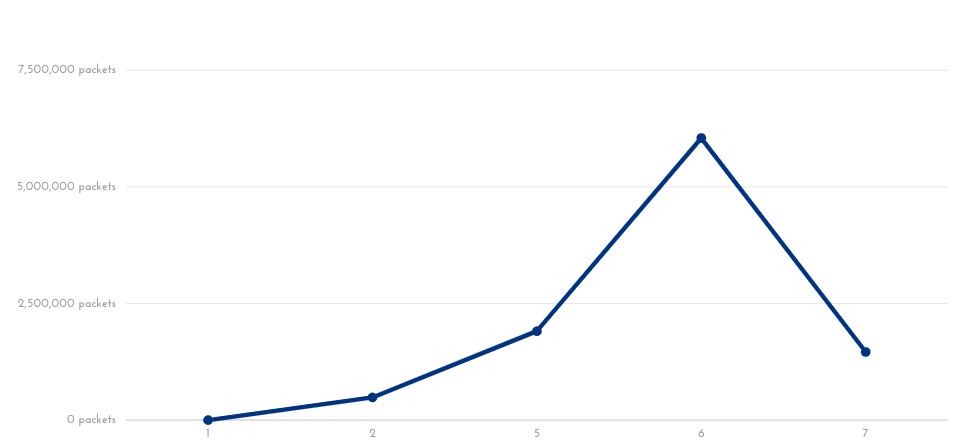
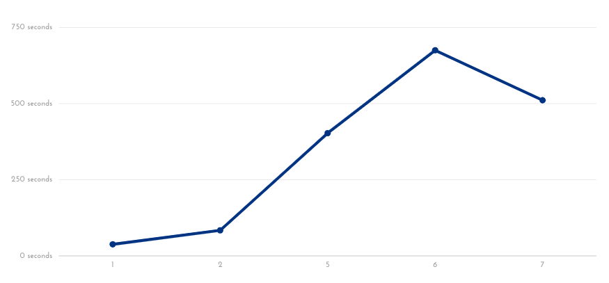

# Functional Testing

|Test No. | Test Name                             | Pass | Fail |
|---------|---------------------------------------|------|------|
|1.1      |Network Connectivity                   |  P   |      |
|1.2      |Handle arp packets                     |  P   |      |
|1.3      |Switching hub                          |  P   |      |
|1.4      |Traffic monitor                        |  P   |      |
|1.5      |High traffic volume detection          |  P   |      |
|1.6      |Ip address and packet storage          |  P   |      |
|1.7      |SYN ACK ratio drop rule                |  P   |      |
|1.8      |SYN ACK ratio drop rule timeout        |  P   |      |
|1.9      |Trusted users list                     |  P   |      |
|1.10     |High volume per ip address drop rule   |  P   |      |
|1.11     |Ip address and packet list clear       |  P   |      |
|1.12     |TCP traffic to controller rule timeout |  P   |      |

# Non Functional Testing

## Bandwidth Testing

### (The bandwidth was tested between two hosts while the application was running. The testing on this aspect of the application was quite light as this likely won't be used while evaluating the application)

|Test No.|h1 Interval |h2 Interval |Transfer |h1 Bandwidth | h2 Bandwidth |
|--------|------------|------------|---------|-------------|--------------|
|2.1     |0.0-10.4s   |0.0-13.6s   |6.38 mb  |5.15mbits/s  |3.93mbits/s   |
|2.2     |0.0-11.9s   |0.0-14.3s   |671 mb   |475mbits/s   |394mbits/s    |
|2.3     |0.0-10.5s   |0.0-14.5s   |767 mb   |613mbits/s   |444mbits/s    |
|2.4     |0.0-11.3s   |0.0-16.1s   |6.62mb   |4.93mbits/s  |3.45mbits/s   |
|2.5     |0.0-10.2s   |0.0-11.5s   |5.75mb   |4.71mbits/s  |4.18mbits/s   |

## Latency Testing

### (Note : testing was done by sending 10 SYN packets between two hosts)

|Test No.|Scenario             |R.T.T   |Average |Max     |
|--------|---------------------|--------|--------|--------|
|3.1     |Not Controller       |0.8ms   |6.0ms   |18.3ms  |
|3.2     |Controller           |10.4ms  |16.8ms  |23.2ms  | 
|3.3     |Blocking 1 attacker  |16.1ms  |19.7ms  |24.4ms  |
|3.4     |Blocking 2 attackers |3.4ms   |9.4ms   |16.0ms  |
|3.5     |Blocking 5 attackers |7.2ms   |10.5ms  |19.4ms  |

## Packet Drop Rate

### (Note : A fail state indicates the application was unable to create drop rules and drop packets from all attackers on the network)

|Test No.|Host no.| Sent      | Dropped  | Speed | Pass | Fail | % not dropped|
|--------|--------|-----------|----------|-------|------|------|--------------|
|4.1     |1       |124,045    |124010    |100/s  |P     |      |0.03%         |
|4.2     |2       |541,328    |541,311   |100/s  |P     |      |0.01%         |
|4.3     |5       |2,517,028  |2,475,024 |100/s  |P     |      |1.67%         |
|4.4     |7       |2,106,454  |1,441,669 |100/s  |      |F     |31.56%        |
|4.5     |1       |1,854,870  |1,854,492 |flood  |P     |      |0.03%         |
|4.6     |2       |3,782,365  |3,296,704 |flood  |P     |      |12.95%        |
|4.7     |5       |25,434,439 |23,527,533|flood  |P     |      |7.50%         |
|4.8     |6       |34,027,532 |27,980,284|flood  |P     |      |17.78%        |
|4.9     |7       |38,101,724 |36,641,611|flood  |P     |      |3.84%         |

### (Note : Graphs contain results collected using hping3's flood mode)

Image 1 : Drop rate based on number of attackers

***

Image 1 : The duration attacks ran based on number of attackers
  

### (note : the durations includes the set up time for launching the attack e.g opening xterm windows and typing in commands so this should be considered)